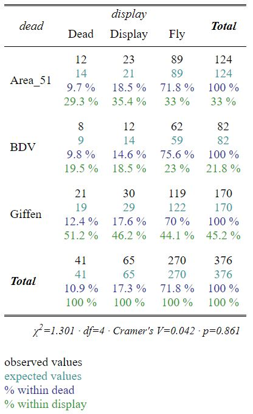

```{r setup, include=FALSE}
knitr::opts_chunk$set(echo = TRUE)
```


```{r, include=FALSE}
library(lsr)
library(tidyverse)
library(pwr)
library(corrplot)
library(sjPlot)
library("graphics")
library(reshape2)
library(likelihood)
library(stats4)
library(fitdistrplus)
library(bootstrap)
library(kableExtra)
```

# Q1. Statistics and the Law
```{r, warning=FALSE }
acorn <- read.csv("acorn.csv")
```

To find out whether the discrimination exists, I decided to do a t-test and a power analysis.

The null hypothesis of this T-Test is

H_0: The mean values of two groups(minority applicants and white applicants) are the same.

And the alternative hypothesis is 

H_1: The mean values of two groups are not the same.
```{R , warning=FALSE}
# t-test
t.test(acorn$MIN,acorn$WHITE)
```
From the t-test we can see that, given alpha =0.05, the t statistics is much greater than 1.96, therefore we reject the null hypothesis. So that we could say the means of refusal rate of minority applicants and white applicants are not the same.

I conducted another t-test to test the means of low income minority applicants and high income minority applicants
```{R , warning=FALSE}
t.test(acorn$MIN,acorn$HIMIN)
```
I still rejected the null hypothesis, so that I concluded that the means of low income minority applicants and high income minority applicants are not the same.

To find out whether the data set contains enough data points to make the t-test valid, I calculated the effect size of the test as well as the power of the analysis.

Note that, the function of cohens_d is sourced from "https://stackoverflow.com/questions/15436702/estimate-cohens-d-for-effect-size"

For the power analysis, Longhao and I worked together to achieve the goal. BTW, Longhao and I are roomates, so we did some of our projects together.
```{R , warning=FALSE}
# Calculate effect size
cohens_d <- function(x, y) {
    lx <- length(x)- 1
    ly <- length(y)- 1
    md  <- abs(mean(x) - mean(y))        ## mean difference (numerator)
    csd <- lx * var(x) + ly * var(y)
    csd <- csd/(lx + ly)
    csd <- sqrt(csd)                     ## common sd computation

    cd  <- md/csd                        ## cohen's d
  }
effsize <- cohens_d(acorn$MIN,acorn$WHITE)
effsize
# Generate power calculations
ptab <- cbind(NULL, NULL)
for (i in seq(0, 2.5, length.out = 200)) {
  pwrt1 <- pwr.t2n.test(
    n1 = 20, n2 = 20,
    sig.level = 0.05, power = NULL,
    d = i, alternative = "two.sided"
  )

  ptab <- rbind(ptab, cbind(pwrt1$d, pwrt1$power))
}

ptab <- cbind(seq_len(nrow(ptab)), ptab)

colnames(ptab) <- c("id", "effect size", "power")


# get data into right format for ggplot2
temp <- ptab %>%
  as.data.frame()
  
# Plot the effect size vs. power
powerplot <- ggplot(temp) +
  geom_line(aes(x = temp$`effect size`, y = temp$power), size = 1.5) +
  geom_vline(xintercept = effsize, linetype = "dashed", color = "red", size = 1.5) +
  xlab("Effect size") + ylab("Power") +ggtitle("Maximum power given 2 treatment data and 5 control data")
powerplot
```
As we can see from the plot, our effec size is 1.977 and the power for the test is very close to 1, therefore the data is sufficient for doing sample t-test.

Conclusion:

From the two t-tests we can conclude that the discrimination of minority applicants could exist and the refusal rates of high income and low income applicants are not the same. However, if we look at both results at the same time, we really don't know whether the differentiated refusal rates is only due to race or not. Because banks might consider a lot of qualifications of applicants such as income.

# Q2. Comparing Suppliers
First step is to create the data frame
```{R, warning=FALSE }
school <- c("Area 51", "BDV", "Giffen")
dead <- c(12,8,21)
display <- c(23,12,30)
fly <- c(89,62,119)
ori <- as.data.frame(cbind(school,dead,display,fly))
ori$dead <- as.numeric(as.character(ori$dead))
ori$display <- as.numeric(as.character(ori$display))
ori$fly <- as.numeric(as.character(ori$fly))
ori
```

To find out whether schools and the quality of orithopters are correlated, I decided to do a chi-square test and draw a contingency table. The null hypothesis is that the two variables, school and quality, are independent.
```{r, warning=FALSE }
ctest <- chisq.test(ori[,2:4])
ctest
```
From the chi-square test we get the chi-square statistics 1.3006. After looking up the Chi-square test table, I found that chi-square test with 4 degrees of freedom and critical value of 0.05 will result in chi-square statistics of 9.488. The chi-square statistics of our test is way smaller than 9.488 therefore I can not reject the null hypothesis. So that I could say the school and quality are independent from each other, in other words, the quanlity of students' art work won't be affected by which shool they are in.

Show the results in contingency table
```{r, warning=FALSE }
ct_school <- c(rep("Area_51",12+23+89),rep("BDV",82),rep("Giffen",51+119))
ct_quality <- c(rep("Dead",12),rep("Display",23),rep("Fly",89),
                rep("Dead",8),rep("Display",12),rep("Fly",62),
                rep("Dead",21),rep("Display",30),rep("Fly",119))
ct <- as.data.frame(cbind(ct_school,ct_quality))
ctstore <- ct %>%
  sjtab(fun = "xtab", var.labels=c("dead", "display","fly"),
        show.row.prc=T, show.col.prc=T, show.summary=T, show.exp=T, show.legend=T)

```
Please note that the "sjtab" plot only output in HTML format, so I have to attach the image of the contingency table. If you run the RMD file, you could run the code and it will work.

The following code for visualizing the chi-square test is sourced from https://towardsdatascience.com/mosaic-plot-and-chi-square-test-c41b1a527ce4
```{R, warning=FALSE }
mosaicplot(~ ct_school + ct_quality, data = ct,
           main = "School and Quality", shade = TRUE)
```
Blue color indicates that the observed value is higher than the expected value if the data were random;

Red color specifies that the observed value is lower than the expected value if the data were random

From the plot we can conclude that the values of three levels of quality are random.

# Q3. Shark Attack
```{r, warning=FALSE }
# Read data
shark <- read.csv("sharkattack.csv")
# Check missing values
sum(is.na(shark$Country))
sum(is.na(shark$Type))
sum(is.na(shark$Continent))
sum(is.na(shark$Hemisphere))
sum(is.na(shark$Activity)) # All look pretty good
```
The data set contains no NAs in the columns I'm going to use to analyze the problem, so I'm good to go.

To analyze whether sharks in Australia is more vicious than sharks in the U.S., I decided to conduct a chi-square test.

My H0 is sharks in Australia is as vicious as sharks in the U.S.

And my alternative hypothesis is they are not the same, in other words, the level of viciousness depend on there the sharks live.
```{R, warning=FALSE }
# Reconstruc data frame
au_us <- shark %>% filter(Country %in% c("United States","Australia"))
au_us$Country <- drop(au_us$Country)
au_us$Country <- as.factor(as.character(au_us$Country))
au_us <- table(au_us$Country, au_us$Fatal)

# Margins
sm1 <- rowSums(au_us)
sm2 <- colSums(au_us)
# Expected
auus_expt <- outer(sm1,sm2, '*')/3256
# Normalized difference
auus_diff <- (au_us - auus_expt)^2/auus_expt
# Test stat
Q <- sum(auus_diff)
# Chi-sq
chi2 <- 1 - pchisq(q = Q, df = 4)
# Chi-sq function in r
chisq.test(au_us)
```
As we can see from the test result, we will be able to reject our null hypothesis which is the level of viciousness doesn't depend on the location that the sharks live. So, we could conclude that the level of viciousness does depend on the location that the sharks live.

Now, let's do a power analysis
```{r, warning=FALSE}
## convert observations into frequencies
au_us_w <- au_us/sum(au_us)
# Power analysis
pw_auus <- pwr.chisq.test(w=ES.w2(au_us_w), N=600, df=2, sig.level=.05)
pw_auus
plot(pw_auus)
```

# Q4. Power Analysis
When should these transformations be applied? The usual rule of thumb is that they should be used when there are a number of proportions close to 0 and/or close to 1. The transformations will "stretch out" proportions that are close to 0 and 1 and "compress" proportions close to 0.5. Source:http://psych.colorado.edu/~carey/courses/psyc5741/handouts/transformations.pdf

For ecological data, proportions of 0% are common, such as when a species doesn't occur in a sample. Values of 100% are also possible, such as when only a single species is present in a sample. In these cases, the range of the logit scale becomes a problem because values of negative infinity will occur whenever a species is absent from a sample and values of positive infinity will be arise in any monospecific sample. Although one could add a small value to prevent a zero proportion or subtract a small value to prevent a proportion of one, such values are arbitrary and the effect of the chosen value would have to be evaluated. An arcsine square root transformation would be more straightforward for these types of problems.
Source:http://strata.uga.edu/8370/rtips/proportions.html

Below codes are sourced from http://strata.uga.edu/8370/rtips/proportions.html
```{R, warning=FALSE }
p <- seq(0.001, 0.999, 0.001)
asinTransform <- function(p) { 2*asin(sqrt(p)) }
pAsin <- asinTransform(p)
plot(p, pAsin, type='l', lwd=2, col='blue', las=1, xlab='p', ylab='arcsine(p)')
```

Now compare the arcsine transformation with a loggit transformation
```{r, warning=FALSE}
logitTransform <- function(p) { log(p/(1-p)) }
pLogit <- logitTransform(p)
rangeScale <- function(x) { (x-min(x)) / (max(x)-min(x)) }

pAsin.scaled <- rangeScale(pAsin)
pLogit.scaled <- rangeScale(pLogit)

plot(p, pAsin.scaled, las=1, type='l', lwd=2, col='blue', xlab='p', ylab='p transformed')
points(p, pLogit.scaled, type='l', lwd=2, col='red')
text(0.8, 0.8, 'asin', col='blue')
text(0.8, 0.5, 'logit', col='red')
```
From my understanding, when we use linear regression to deal with probability problems the line will go beyond the interval of [0,1], and it creates cases that do not make sense. So, we use logit transformation to prevent that problem. The regression line of logit will always between [0,1], it will get really close to 0 or 1 but it never go beyond. Similar to logit transformation, as we can see from the plot, arcsince transformation will change a line that go beyond [0,1] to be close to 0 or 1.

Take the example from the book
```{r, warning=FALSE }
es1 <- asinTransform(0.65)-asinTransform(0.45)
es2 <- asinTransform(0.25)-asinTransform(0.05)
```

# Q5. MLE
## (i) Exponential distribution
The density function of exponential distribution is 

$f(x) = \frac{1}{\lambda} e ^ {- \lambda x} \qquad x > 0$

The likelihood of exponential distribution is

$L(\lambda;x_1...x_n)=\lambda^nexp(-\lambda\sum_{j=1}^{n}x_j)$

The log-likelihood is

$l(\lambda;x_1...x_n)=nln(\lambda)-\lambda\sum_{j=1}^{n}x_j)$

Then the maximum likelihood estimator is 

$\frac{d}{d_\lambda} l(\lambda; x_1,...,x_n) = 0$

$\hat \lambda=\frac{n}{\sum^n_{j-1}x_j}$

## (ii) A new distribution
### part.a Find the method of moments estimator
As we know, the $j^(th)$ moment of X is

$\alpha_j(\theta)=E_\theta(X^j)=\int x^jdF_\theta(x)$

Therefore, for this new distribution, we have the first moment as below

$E_\theta(X)=\int_{0}^{1} xf(x)dx=\int_{0}^{1} (x(1-\theta+2\theta x))dx=\int_{0}^{1} (x-x\theta+2\theta x^2)dx=\frac{1}{2}x^2 - \frac{1}{2}x^2\theta + \frac{2}{3}\theta x^2|_{0}^{1}=\frac{1}{2} + \frac{1}{6}\theta$

And we know the first moment is the mean, so we have

$\frac{1}{2} + \frac{1}{6}\theta=\frac{1}{n} \sum_{j=1}^{n}x_j$

then we have 

$\theta = \frac{6}{n} \sum_{j=1}^{n}x_j -3$

### part.b Find the MLE
The most common way to calculate MLE is to use the log-likelihood and compute the first derivative w.r.t. the parameter and set the result to zero, and solve for parameter. Let's try this way first.

The likelihood of this distribution is 

$L= \prod_{i=1}^{n}f(x_i)=\prod_{i=1}^{n} (1-\theta)+2\theta x_i$

Then we take log of the likelihood and we have

$l=\sum_{i=1}^{n} log((1-\theta)+2\theta x_i)=log(n-\theta(n-2\sum_{i=1}^{n} x_i))$

Finally we take partial derivative of the log-likelihood and set it to zero

$\frac{\partial l}{\partial \theta}=\frac{2\sum_{i=1}^{n} x_i - n}{n-\theta(n-2\sum_{i=1}^{n} x_i)}=0$

As we can see, we can not solve the equation to get a real value of our MLE $\hat \theta$. We note that $\prod_{i=1}^{n} 1+\theta(2x_i-1)$ is a increasing function of $\theta$, so that the $L$ will be maximized at $\hat \theta=x_n$ where $x_n$ is the largest value in the data.

Another is to use simulation.

First, calculate the CDF

$F(x)=\int f(x)dx=\int_{0}^{x} 1-\theta+2\theta x dx=x-\theta x +\theta x^2$

I tried to make some calculations to form an equation like $x=F^{-1}(p)$, however, it's really hard to do... So I assumed Xs are from a uniform distribution and simulated 50000 samples. By the way, I totally understand the example for the exponential distribution you showed us, but it is too hard to do something like that in this question...

Update May 6. keep solving the equation of CDF and we can get the inverse CDF as following

$\theta x^2+(1-\theta)x+p=0$ and $x=\frac{\theta-1 \pm \sqrt{(1-\theta)^2-4\theta p}}{2\theta}$

```{R, warning=FALSE }
# simulate 50000 data points
set.seed(9999)
n=50000
sim1 <- runif(n,0,1)
theta1 <- 6*mean(sim1)-3
newdis <- function(theta){
 newdis <- log(n-theta*(n-2*sum(sim1)))
}
newdis_search <- nlm(newdis,theta1,hessian = TRUE)
newdis_search
```
The MLE of $\hat \theta = -0.4325$

## (iii) Rain in Southern Illinois
I'm going to use empirical distribution to find out what distribution does the data belong to.
```{r, warning=FALSE }
ill_60 <- read_csv("ill-60.txt", col_names = FALSE)
ill_61 <- read_csv("ill-61.txt", col_names = FALSE)
ill_62 <- read_csv("ill-62.txt", col_names = FALSE)
ill_63 <- read_csv("ill-63.txt", col_names = FALSE)
ill_64 <- read_csv("ill-64.txt", col_names = FALSE)
master1 <- rbind(ill_60,ill_61,ill_62,ill_63,ill_64)
```
```{r, warning=FALSE }
# Plot distribution
plotdist(master1$X1)
```
The distribution seems to be heavily right skewed.

```{R, warning=FALSE }
# describe distribution with 1000 bootstraps
descdist(master1$X1, boot = 1000)
# describe by year
par(mfrow=c(3,2))
des60<- descdist(ill_60$X1, boot = 1000)
des61<- descdist(ill_61$X1, boot = 1000)
des62<- descdist(ill_62$X1, boot = 1000)
des63<- descdist(ill_63$X1, boot = 1000)
des64<- descdist(ill_64$X1, boot = 1000)
```
The distribution seems to belong to beta distribution and it is close to a Gamma distribution.

Now let's do a ks-test
```{r, warning=FALSE }
# ks-test for beta distribution
ks.test(master1$X1,pbeta(q = c(0.25,0.5,0.72),shape1 = 2,shape2 = 2))
```
As we can see from the ks-test, the p value is 0.1969, and it indicates that we can not reject the null hypothesis. Hence, we can conclude that the distribution of the data is not different from beta distribution.

Now, let's try gamma
```{R }
ks.test(master1$X1,pgamma(q = c(0.25,0.5,0.72),shape = 2))
```
Again, we see a large p-value and so that we can not reject the null hypothesis. Therefore, we can conclude that the distribution of the data is not different from gamma distribution.

Now, let's compare the data year by year to see if they are the same
```{R, warning=FALSE }
# 60 and others
ks.test(ill_60$X1,ill_61$X1)
ks.test(ill_60$X1,ill_62$X1)
ks.test(ill_60$X1,ill_63$X1)
ks.test(ill_60$X1,ill_64$X1)
```
The distribution of data from 1960 is not different from other years

```{R, warning=FALSE }
# 61 and others
ks.test(ill_61$X1,ill_62$X1)
ks.test(ill_61$X1,ill_63$X1)
ks.test(ill_61$X1,ill_64$X1)
```
The distribution of data from 1961 is not different from other years

```{R, warning=FALSE }
# 62 and others
ks.test(ill_62$X1,ill_63$X1)
ks.test(ill_62$X1,ill_64$X1)
```
The distribution of data from 1962 is not different from other years

```{R, warning=FALSE }
# 63 and others
ks.test(ill_63$X1,ill_64$X1)
```
The distributions of data from 1963 and 1964 are not different from other years

Enough ks-tests, let's look at the median and mean of the data for each year
```{r, warning=FALSE }
year <- c(rep("1960",48),rep("1961",48),rep("1962",56),rep("1963",37),rep("1964",38))
master2 <- cbind(master1,year)
ggplot(data = master2,aes(x=year,y=X1))+geom_boxplot()+
  stat_summary(fun.y = mean, geom = "point", col="blue", size=2)
```
From the boxplot, I would say the mean of each data seems to be similar. Since the data is not normally distributed, therefore, we are not able to perform t-test or ANOVA test.

The methods of moment estimator
```{r, warning=FALSE}
mean(master1$X1);(sd(master1$X1))^2
```
$E(x)=\frac{\alpha}{\beta}=\frac{\sum x_i}{n}=0.2243$

$Var(x)=\frac{\alpha}{\beta^2}=0.1338$

Solve the two equations, we have $\alpha=0.37616$ and $\beta=1.6763$, where $\alpha$ is the shape parameter and $\beta$ is the rate parameter.

To get the MLE of Gamma distribution, we do the following steps:

$L(\alpha,\beta|x)=(\frac{\beta^\alpha}{\Gamma(\alpha)})^n (x_1x_2...x_n)^{\alpha-1}e^{-\beta(x_1+x_2+..+x_n)}$

$l(\alpha,\beta|x)=n(ln\beta - ln\Gamma(\alpha))+(\alpha-1)\sum lnx_i - \beta \sum x_i$

$\frac{\partial l}{\partial \beta}=n \frac{\alpha}{\beta}- \sum x_i=0$

$\hat \beta = \frac{\hat \alpha}{\sum x_i}$

$\frac{\partial l}{\partial \alpha}=n(ln\alpha - ln\sum x_i - \frac{\partial ln\Gamma(\alpha)}{\partial \alpha})+\sum x_i=0$

$\psi(\alpha)=\frac{\partial ln\Gamma(\alpha)}{\partial \alpha}$

By using R, we can get the MLE for $\alpha$ and $\beta$. Note, part of the codes are sourced from http://www.utstat.toronto.edu/~brunner/oldclass/appliedf12/lectures/2101f12Likelihood1.pdf
```{r, warning=FALSE }
mom.alpha <- mean(master1$X1)^2 / var(master1$X1)
mom.beta <- var(master1$X1) / mean(master1$X1)

gmll <- function(theta,datta){
 a <- theta[1]; b <- theta[2]
 n <- length(datta); sumd <- sum(datta)
 sumlogd <- sum(log(datta))
 gmll <- n*a*log(b) + n*lgamma(a) + sumd/b - (a-1)*sumlogd
 gmll
}

gammasearch <- nlm(gmll,c(mom.alpha,mom.beta),hessian = TRUE,datta=master1$X1)
gammasearch
```
From the result we can see $\hat \alpha =0.4407$ and $\hat \beta = 0.50906$

Now we use bootstrap, the codes are sourced from http://www.stat.umn.edu/geyer/3701/notes/bootstrap.pdf
```{r, warning=FALSE }
# Starting point of alpha and beta
theta.start <- c(mom.alpha,mom.beta)
# Find mle (similar to what I have done previously)
mlogl <- function(theta, x) {
  stopifnot(is.numeric(theta))
  stopifnot(is.finite(theta))
  stopifnot(length(theta) == 2)
  alpha <- theta[1]
  beta <- theta[2]
  sum(- dgamma(x, shape = alpha, scale = beta, log = TRUE))
}
  oout <- optim(theta.start, mlogl, x = master1$X1, method = "BFGS")
  oout$convergence==0
  oout$par
# Since we got warnings, redo the previous step
  oout <- optim(oout$par, mlogl, x = master1$X1, method = "BFGS")
  oout$convergence == 0
  oout$par
```

Now let's do boostrap
```{r, warning=FALSE }
# Ready for boostrapping
  set.seed(2019)
  nboot <- 1000
  theta.hat <- oout$par
  alpha.hat <- theta.hat[1]
  beta.hat <- theta.hat[2]
  starter <- function(x) c(mean(x)^2 / var(x), var(x) / mean(x))
  alpha.star <- double(nboot)
  alpha.star.asymp.var <- double(nboot)
  for (iboot in 1:nboot) {
  xstar <- rgamma(length(master1$X1), shape = alpha.hat, scale = beta.hat)
  oout <- suppressWarnings(optim(starter(xstar), mlogl, x = xstar,
  method = "BFGS", hessian = TRUE))
  while (oout$convergence != 0)
  oout <- suppressWarnings(optim(oout$par, mlogl, x = xstar,
  method = "BFGS", hessian = TRUE))
  alpha.star[iboot] <- oout$par[1]
  alpha.star.asymp.var[iboot] <- solve(oout$hessian)[1, 1]
  }
  hist(alpha.star)
  abline(v = alpha.hat, lty = 2, col="red")
```
The boot strap method gives us more information about the distribution of the parameter, therefore I would prefer the boostrap method for estimating the estimates.

# Q.6 Manski's work
As the article has mentioned, we have Beta distribution as our prior distribution and we have Binomial distribution as the distribution of data. To calculate the posterior distribution, we have the following steps.

Prior (Beta distribution with parameter c and d)

$f(\beta)=\frac{\Gamma(c+d)}{\Gamma(c) \Gamma(d)}\beta^{c-1}(1-\beta)^{d-1}$

Likelihood (Binomial distribution with N and n)

$f(Y|\beta)=\binom{N}{n}\beta^{n}(1-\beta)^{N-n}$

The posterior will be the product of prior distribution and the likelihood

$P(\beta|Y)=f(\beta)f(Y|\beta)=\frac{\Gamma(c+d)}{\Gamma(c) \Gamma(d)}\beta^{c-1}(1-\beta)^{d-1}\binom{N}{n}\beta^{n}(1-\beta)^{N-n}$

Re-order the equation and we have

$P(\beta|Y)=\frac{\binom{N}{n}\Gamma(c+d)}{\Gamma(c) \Gamma(d)}\beta^{c+n-1}(1-\beta)^{d+N-n-1}$

Finally, we have a Beta distribution $Beta(c+n-1,d+N-n-1)$

Based on the information from https://ocw.mit.edu/courses/mathematics/18-05-introduction-to-probability-and-statistics-spring-2014/readings/MIT18_05S14_Reading14a.pdf

Our posterior could be $Beta(c+n,d+N-n)$ which is a little different from what we have got.

The mean of Beta distribution is $\frac{\alpha}{\alpha + \beta}$. By plugging in our posterior parameters, we have

$\frac{c+n}{c+d+N}$ which is exactly what Manski got. Great!

As we have known, the $\alpha$ is the expected values of the outcomes of the group that is assigned to treatment A

$\alpha=E[y(A)]$

And in this randomized trial, treatment A refers to status quo and treatment B refers to innovation. Therefore, when we set $\alpha$ as the thredhold, in order to optimize the outcomes, we will assign all people to treatment A if $\beta < \alpha$, and assign all people to treatment B if $\beta > \alpha$. If $\beta=\alpha$, we assign people to both treatment A and B in proportions. By doing this, we have the following rules:

Note that, as we have proved previously, the posterior mean for $\beta$ is $\frac{c+n}{c+d+N}$

$\delta(n)=0$ for $\frac{c+n}{c+d+N}< \alpha$

$\delta(n)=\lambda$ for $\frac{c+n}{c+d+N}= \alpha$

$\delta(n)=1$ for $\frac{c+n}{c+d+N}> \alpha$

Next, let's reproduce the the table of threshold sample size and threshold allocation.

Table of threshold sample size

The $\alpha$ in the table is the threshold, I calculate the empirical success rate for $\beta$ and compare it to $\alpha$. If $\beta$ is greater than $\alpha$, assign treatment B to all patients, if it is less than $\alpha$, assign all patients to treatment A.

For example, when N=6 and $\alpha=0.75$. 

$n=0,1,2,3,4,5,6$ and the empirical success rates are $\frac{n}{N}=0,\frac{1}{6},\frac{1}{3},0.5,\frac{2}{3},\frac{5}{6},1$

Since $\frac{5}{6} > \alpha$, therefore, the threshold will be set at 5.
```{r }
tss <- as.data.frame(matrix(nrow = 5, ncol = 12))
colnames(tss) <- c("alpha","N=0","N=1","N=2","N=3","N=4","N=5","N=6","N=7","N=8","N=9","N=10")
tss[,1] <- c(0.1,0.25,0.5,0.75,0.9)
#tss[,2] <- c(rep(0,5))
for (a in 1:5) {
  for (N in 1:11) {
    for (n in 0:11) {
    beta <- n/N
    if(beta>tss[a,1]){
      break
     }
    }
    tss[a,N+1] <- n-1
  }
}
kable(tss)
```

Table of threshold allocation

In this table, we are asked to calculate the value of $\lambda$ which is the proportion of people receive treatment A oe B. Take one observation from the table as an example.

$N=5$, $\alpha=0.25$, $n=0,1,2,3,4,5$ and we plug in the $\lambda=0.42$

Since we know the outcomes follow Binomial distribution, we have

$\binom{5}{1}0.42^1(1-0.42)^4=0.2376464$ which is close to the $\alpha=0.25$

If we reverse the procedure, we could get the proportion by doing

$0.25=\binom{5}{1}prop.^1(1-prop.)^4$

By solving the equation above we will get the value.
